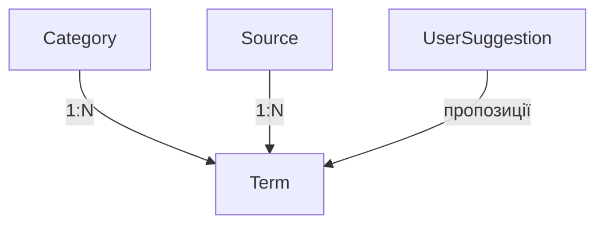
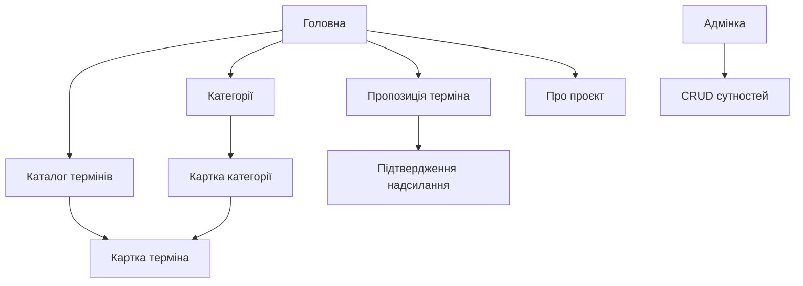

# Діаграми проєкту

## ER-модель

```mermaid
flowchart TD
  Category[Category]
  Source[Source]
  Term[Term]
  UserSuggestion[UserSuggestion]
  Category -->|"1:N"| Term
  Source -->|"1:N"| Term
  UserSuggestion -->|"пропозиції"| Term
```

## Схема навігації

```mermaid
flowchart TD
  Home[Головна] --> Terms[Каталог термінів]
  Home --> Categories[Категорії]
  Home --> Suggest[Пропозиція терміна]
  Home --> About[Про проєкт]
  Terms --> TermDetail[Картка терміна]
  Categories --> CategoryDetail[Картка категорії]
  CategoryDetail --> TermDetail
  Suggest --> SuggestDone[Підтвердження надсилання]
  Admin[Адмінка] --> Crud[CRUD сутностей]
```
